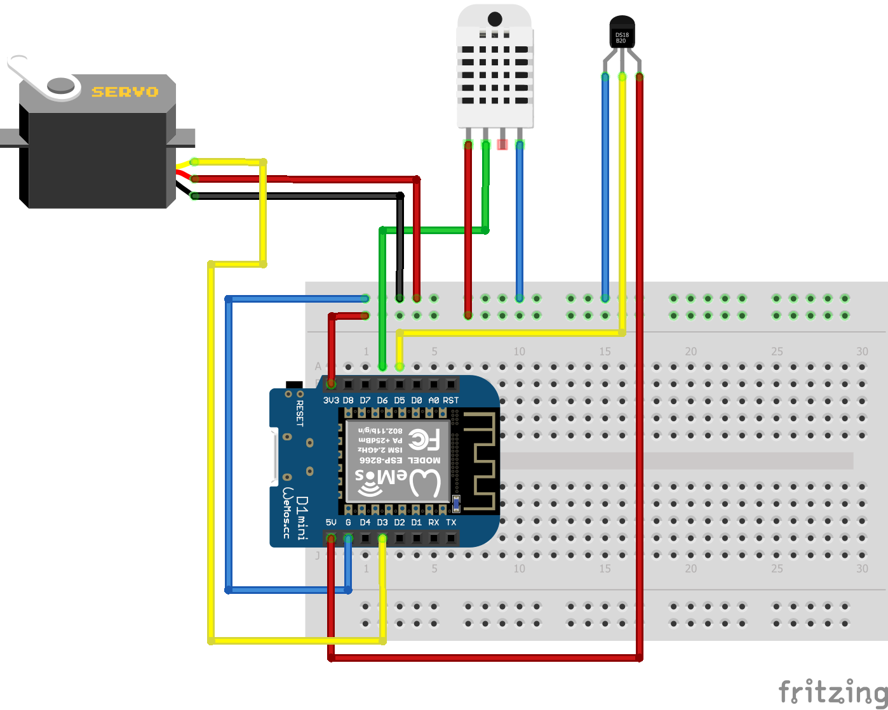
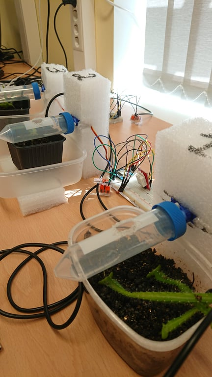
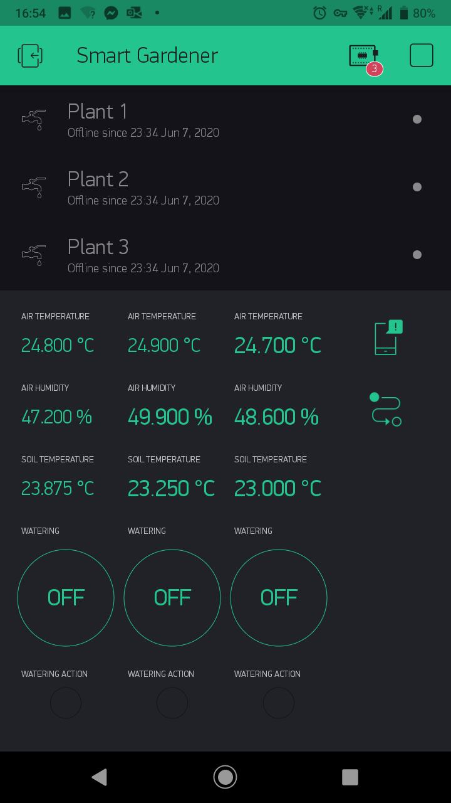

# Smart_gardener
Smart gardener is a project that involves microcontrollers and sensors taking care of plants by measuring air temmperature, humidity, soil moisture and watering them by using reservoirs atached to servos.
This is repository created for project and contains all necessesary codes for it and required information/instructions to replicate it.

Required parts for this project are:
- At least one [Wemos D1 mini](https://docs.wemos.cc/en/latest/d1/d1_mini.html) or any other ESP8266 based microcontroller.
- [RasPI](https://en.wikipedia.org/wiki/Raspberry_Pi) that will act as a server platform (In this project 3B+ version is being used).
- Sensors: [DHT22](https://www.waveshare.com/wiki/DHT22_Temperature-Humidity_Sensor) air temperature and humidity sensor. [DS18B20](https://wiki.eprolabs.com/index.php?title=DS18B20_Temperature_Sensor) waterproof temperature sensor. 
- Actuators: [TG9e](https://servodatabase.com/servo/turnigy/tg9e) for water supply.
- Reservoirs to store water.
- WiFi access point. In this project local WiFi through seperate [router](https://www.tp-link.com/us/home-networking/wifi-router/tl-wr740n/).

## Hardware
1. Sensors and actuators are connected to microcontroller. Following connections are made as depicted in .
2. Actuators are connected to reservoirs and positioned securely over the plant, e.g.,  
## Software
1. RasberryPI 32-bit OS was used on RasPI. Used release version was `May 2020 2020-05-27`.
2. [Blynk](https://blynk.io) local custom server was setup according to instructions from author repository. Java 11 server version and release of `v0.41.13` Step-by-step instructions are available [here](https://github.com/blynkkk/blynk-server).   
3. Local WiFi network was setup by router. Static IP was assigned to RasPI.
4. Connection tested by downloading Blynk phone app and connecting to Blynk environment using credentials and IP address of RasPI through default 9443 port. NB! Phone also has to be connected to local WiFI.
5. Authorization tokens for each Wemos device was aqcuired and placed in the arduino code `smart_gardener.ino` together with WiFi credentials.
6. Following app widgets were used:
 - Labeled value (To display air temperature, humidity and soil moisture)
 - Switch button (To control ON/OFF state of the water supply)
 - Notification widget that allows to display notification on the smartphone.
 - Eventor that schedules notification to be sent to user, reminding to water plants and fill the tank. With newer update eventor will be able to water plants automatically while using [multiple devices](https://github.com/blynkkk/blynk-server/issues/552).
 - Virtual LED that shows whenever the microcontroller has received the signal from button.
 Example of layout can be seen in this .
7. ESP8266 code was designed that pushes values it receives from sensors to respective Virtual pins on Blynk app. Additionally code reads the state of the Button virtual pin and accordingly switches ON/OFF the water supply from the reservoir.      